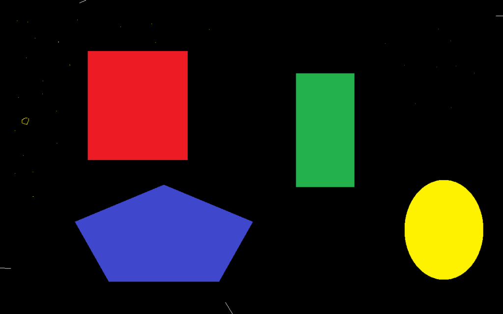
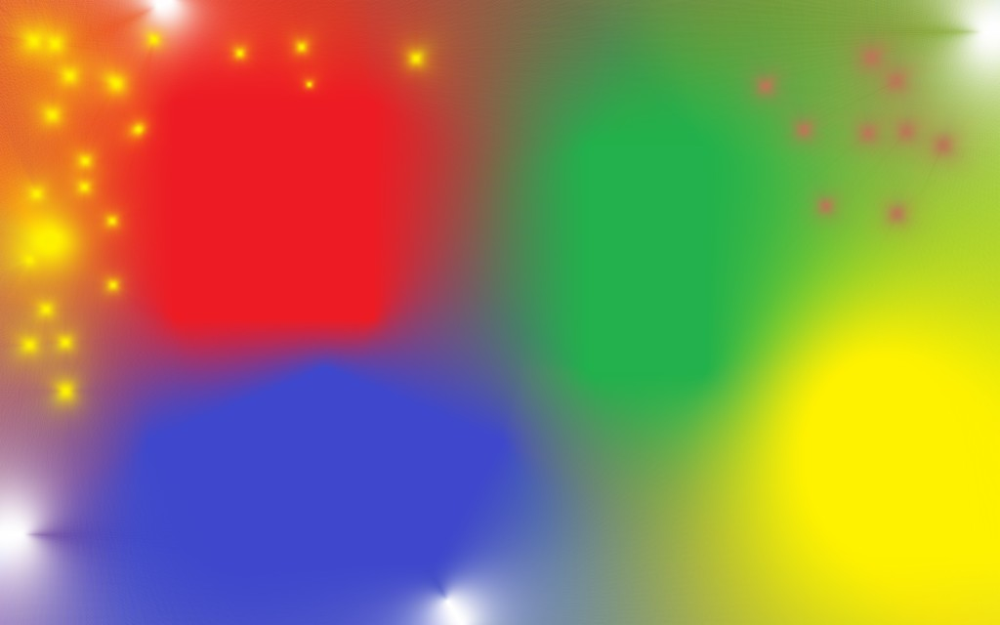

# myInterpolator

MyInterpolator fills voids in images from surrounding pixels using an approximation of the inverse distance weighting (IDW) technique along sets of parallel paths of arbitrary directions. For a detailed description of the algorithm please refer to the following paper:

(citation will be added after publication)

## 1. License

MyInterpolator is Copyright (C) 2022  Dirk 'jtk' Frommholz, [DLR OS-SEC](https://www.dlr.de/os/en/desktopdefault.aspx/).

This program is free software: you can redistribute it and/or modify
it under the terms of the GNU General Public License as published by
the Free Software Foundation, either version 3 of the License, or
(at your option) any later version.

This program is distributed in the hope that it will be useful,
but WITHOUT ANY WARRANTY; without even the implied warranty of
MERCHANTABILITY or FITNESS FOR A PARTICULAR PURPOSE.  See the
[GNU General Public License](https://www.gnu.org/licenses/) for more details.

If you wish to use the code of this software for a proprietary application or are interested in the GPU (OpenCL) implementation, please contact the author directly under the address mentioned in [this document](linkToPaper).

## 2. Build instructions

MyInterpolator uses [CMake](https://cmake.org) 3.17+ as its build system which must be available on your system together with a decent C++ compiler. As libraries, [libtiff](https://libtiff.gitlab.io/libtiff/) is required with any dependencies handling [TIFF](https://en.wikipedia.org/wiki/TIFF) image compression. Source documentation will be generated with [doxygen](https://www.doxygen.nl/index.html) if present.

* To configure the software and create project files for the compiler toolchain of your platform, in the directory where the CMakeLists.txt file resides, type:

    `cmake -DCMAKE_INSTALL_PREFIX=<installdir> -DCMAKE_BUILD_TYPE=<config> -B <builddir> -S .`

    Here, _\<installdir>_ is the directory where the binaries and documentation shall be placed (e.g. _\/usr/local/myInterpolator_). The built type _\<config>_ can be set to either _debug_ or _release_ for single-config project generators like classic Makefiles under Linux. This will produce unoptimized debuggable or optimized production-ready binaries respectively. For multi-configuration project generators like Visual Studio under Windows, this setting must be given at build time (see below). The _\<builddir>_ directory is where the project files produced by the generator shall be placed. For single-config project generators, each platform shall be given its own directory which must exist already.

* To build and install debug and optimized release versions of the software, type:

    `cmake --build <builddir> --target install --parallel`

    for single-config project generators for each `<builddir>` or

    `cmake --build <builddir> --config debug --target install --parallel`

    `cmake --build <builddir> --config release --target install --parallel`

    for multi-config generators to produce debug and optimized builds of the software respectively.

* You can use the provided scripts for Windows and Unix/Linux (for the bash shell) to configure, compile and install the tool. This will also create the build directory, however, the install directory must exist already:

​		`compileInstallLinux.sh <builddir> <installdir>`

​		`compileInstallWindows.sh <builddir> <installdir>`

## 3. Invoke the myInterpolator tool

MyInterpolator accepts [TIFF](https://en.wikipedia.org/wiki/TIFF) images up to 32-bit float pixel components for interpolation. There is no limit on the color channels, and any compression scheme supported by the installed libtiff prerequisite will be supported for input bitmaps. Output will be in uncompressed TIF format preserving the input pixel data type.

* To fill the void patches inside a TIFF image, in the installation directory from above, the minimal command line is:

    `myInterpolator <inImageUri> <outImageUri>`

    This will produce an interpolated output image under _\<outImageUri>_ assuming zero intensities for the voids of the input bitmap under _\<inImageUri>_. 

* To alter the default behavior of the interpolator, options can be bassed before the input image URI. 

    ~~~
    --bgnd <n> <int0> ... <intn-1>
                sets the background (hole) color for n components   
                (defaults to 0 if not provided)

    --dir <n>
                sets the number of interpolation directions

    --disableOC
                disables oversamplig compensation, i.e., do not weigh   
                close-by neighbor pixels less and distant pixels more in   
                order to to simulate regular contour sampling

    --idwSmoothness <s>
                sets the exponent to be applied to the distance to   
                neighboring pixels in inverse distance weighting(1=linear,  
                2=quadratic decay)

    --offset <deg>
                sets the angular offset of the interpolation paths in degrees

    --postprocess sx sy
                smoothen interpolated pixels with Gauss filter of kernel   
                size sx by sy

    --threads <count>
                sets the number of processing threads
    ~~~

    The most important options are _--bgnd_ defining the background color, i.e., the color of the void pixels to be interpolated from valid neighbors, and _--dir_ which controls number of path directions, or neighbor subsampling rate. Higher values for the direction count will achieve a better approximation of ideal IDW. For good results, _--dir 256_ or higher is recommended.

## 4. Examples

* Simple test image

    RGB (3-channel) input image _holes_big.tif_, black void areas

    

    Interpolated output image _holes_big_ip256.tif_ resulting from

    `myInterpolator.exe --bgnd 3 0 0 0 --dir 256 holes_big.tif holes_big_ip256.tif`

    

